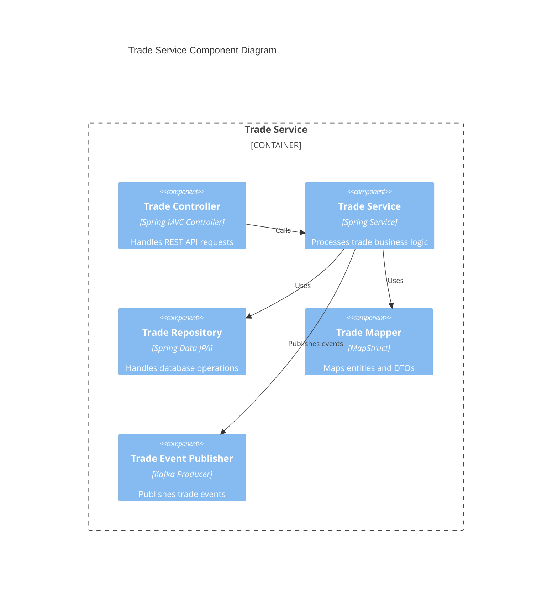

# ReconX C4 Component Diagram

```mermaid
C4Component

title Trade Service Component Diagram


Container_Boundary(tradeService, "Trade Service") {


Component(controller, "Trade Controller", "Spring MVC Controller", "Handles REST API requests")

Component(service, "Trade Service", "Spring Service", "Processes trade business logic")

Component(repository, "Trade Repository", "Spring Data JPA", "Handles database operations")

Component(mapper, "Trade Mapper", "MapStruct", "Maps entities and DTOs")

Component(eventPublisher, "Trade Event Publisher", "Kafka Producer", "Publishes trade events")


}


Rel(controller, service, "Calls")

Rel(service, repository, "Uses")

Rel(service, mapper, "Uses")

Rel(service, eventPublisher, "Publishes events")
```