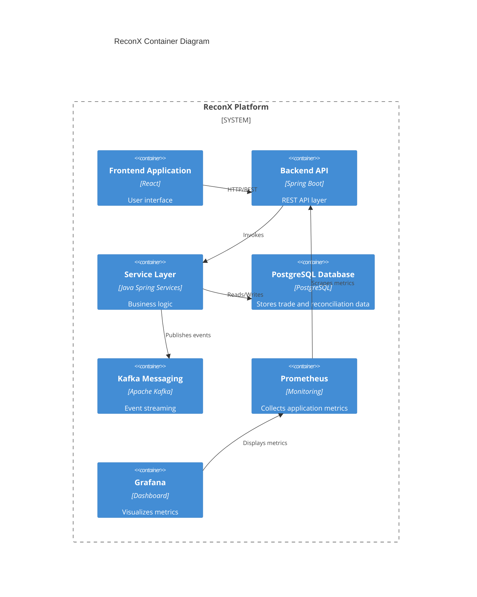

# ReconX C4 Container Diagram

```mermaid
C4Container

title ReconX Container Diagram


System_Boundary(reconx, "ReconX Platform") {


Container(frontend, "Frontend Application", "React", "User interface")

Container(api, "Backend API", "Spring Boot", "REST API layer")

Container(service, "Service Layer", "Java Spring Services", "Business logic")

Container(database, "PostgreSQL Database", "PostgreSQL", "Stores trade and reconciliation data")

Container(kafka, "Kafka Messaging", "Apache Kafka", "Event streaming")

Container(prometheus, "Prometheus", "Monitoring", "Collects application metrics")

Container(grafana, "Grafana", "Dashboard", "Visualizes metrics")


}


Rel(frontend, api, "HTTP/REST")

Rel(api, service, "Invokes")

Rel(service, database, "Reads/Writes")

Rel(service, kafka, "Publishes events")

Rel(prometheus, api, "Scrapes metrics")

Rel(grafana, prometheus, "Displays metrics")
```