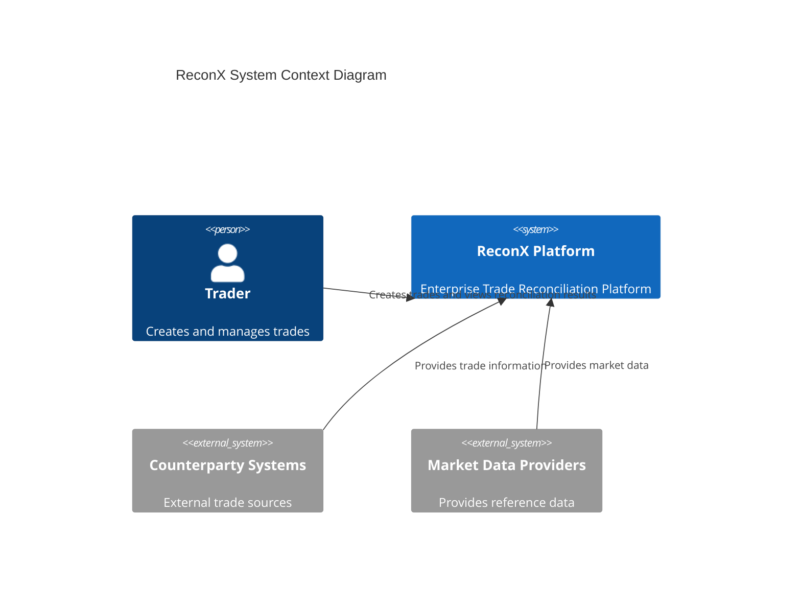

# ReconX C4 Context Diagram

```mermaid
C4Context

title ReconX System Context Diagram

Person(trader, "Trader", "Creates and manages trades")

System(reconx, "ReconX Platform", "Enterprise Trade Reconciliation Platform")

System_Ext(counterparty, "Counterparty Systems", "External trade sources")

System_Ext(market, "Market Data Providers", "Provides reference data")


Rel(trader, reconx, "Creates trades and views reconciliation results")

Rel(counterparty, reconx, "Provides trade information")

Rel(market, reconx, "Provides market data")
```